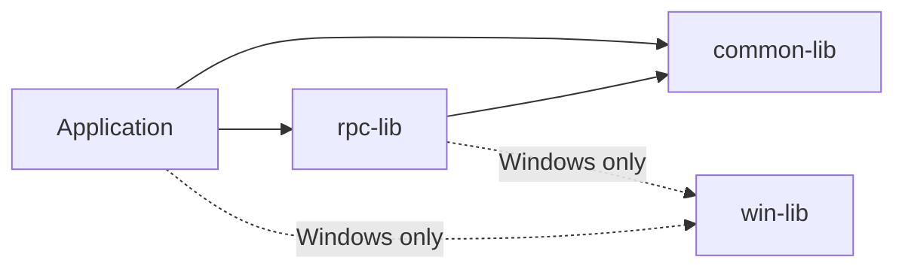
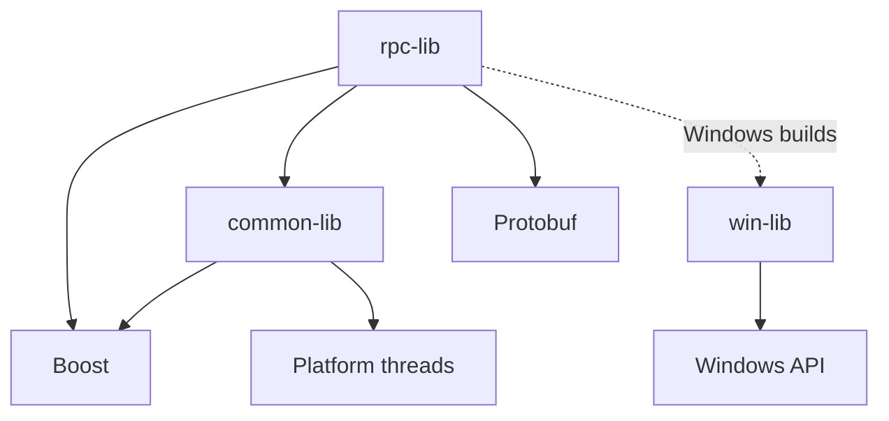

# Architecture

This document describes the high-level structure of `common`: the boundaries
between its libraries, the direction of dependencies, and the principles to
follow when extending the repository. It deliberately avoids class-level API
documentation and protocol details.

## System context

`common` is distributed as a set of static C++ libraries in one installable
CMake package. Applications may use the general-purpose facilities directly or
build higher-level functionality on top of the RPC library.



The dependency graph is intentionally one-directional:

- `common-lib` does not depend on either of the other project libraries;
- `win-lib` does not depend on either of the other project libraries;
- `rpc-lib` builds on `common-lib` and uses `win-lib` only on Windows.

Keeping the lower-level libraries independent prevents RPC concerns from
leaking into general utilities and keeps Windows-specific code out of portable
components.

## Components

### `common-lib`

`common-lib` provides general-purpose, platform-independent utilities. It is
the portable foundation of the repository and is suitable for direct use by
applications as well as by other libraries.

Its facilities cover broad categories such as concurrency, synchronization,
memory management, data handling, and compile-time programming. Features added
to this library should be useful outside a single application domain and
should not depend on RPC or platform-specific APIs.

The library uses the `vshalygin::cl` namespace and is exported as the CMake
target `vshalygin::common-lib`.

### `rpc-lib`

`rpc-lib` provides asynchronous remote procedure calls on top of Protocol
Buffers services and messages. It owns RPC-specific concerns such as endpoint
lifecycle, connection management, authentication, request and response
processing, and transport-independent communication.

Transport behavior is represented by interfaces rather than embedded in the
endpoint API. This separation allows transports with different connection and
I/O models to be implemented without changing the RPC-facing application
interface. Detailed request flow, transport contracts, and protocol structure
belong in [RPC architecture and protocol](rpc-architecture.md).

The library uses the `vshalygin::rpc` namespace and is exported as the CMake
target `vshalygin::rpc-lib`.

### `win-lib`

`win-lib` contains reusable components whose meaning or implementation is
specific to Windows. It is the designated boundary for direct use of Windows
facilities that do not belong to a more specialized library.

Keeping these components separate lets portable targets avoid accidental
Windows dependencies. The library is built and exported only when the target
platform is Windows. It is available to consumers as `vshalygin::win-lib`.

### Examples

The `example/` directory contains small working applications that demonstrate
how the installed libraries are used. Examples are deliberately excluded from
the root build tree. Each example is an independent CMake project that calls
`find_package()` and links to exported targets in the same way as an external
consumer.

This boundary verifies more than compilation: it verifies that installation,
package discovery, exported usage requirements, and transitive dependencies
are sufficient for a real client.

### Tests

The `test/` directory mirrors the library boundaries with separate test
executables. Tests are part of the root build when `BUILD_TESTING` is enabled,
but they are not installed. GoogleTest cases are registered individually with
CTest so failures, timeouts, and filtering operate at test-case granularity.

## Dependency architecture

Project targets consume external libraries exclusively through CMake targets.
The current dependency relationships are:



The checked-in presets use vcpkg manifest mode to provide these dependencies
reproducibly. vcpkg is a recommended dependency provider, not an architectural
requirement of the source code: a custom build may supply compatible CMake
packages through another toolchain or a prebuilt installation.

Dependencies exposed by a library's public headers or link interface are
declared as public CMake dependencies. They therefore propagate through the
installed imported targets instead of requiring consumers to reconstruct the
link graph manually.

## Public and internal boundaries

Each library has an include root matching its target name:

```text
common-lib/common-lib/...
rpc-lib/rpc-lib/...
win-lib/win-lib/...
```

Consumers include public headers from that root, for example:

```cpp
#include <common-lib/thread/thread.h>
#include <rpc-lib/client-endpoint.h>
```

Directories named `internal/` contain implementation details. They may be
installed because public templates or inline definitions require them to be
available to the compiler, but installation does not make them public API.
Consumers should not include them directly or rely on their names, types, or
behavior remaining stable.

Public declarations use library-specific namespaces. The `vshalygin::`
namespace used by installed CMake targets is a build-system namespace and is
independent of the C++ namespace hierarchy.

## Asynchronous execution model

Asynchronous work is scheduled through the execution facilities provided by
`common-lib`. Futures represent eventual results, while thread pools and
strands provide execution and serialization contexts. `rpc-lib` builds its
connection and request workflows on this model rather than maintaining a
separate asynchronous abstraction.

Execution contexts are supplied to asynchronous objects by their owner. These
objects do not implicitly create a private thread pool, so an application can
control thread count, scheduling, and shutdown at the system boundary. The
owner is responsible for keeping a supplied execution context alive and active
for as long as dependent asynchronous work may use it.

Mutexes, strands, and other synchronization mechanisms coordinate concurrent
access to mutable state shared by asynchronous operations. They neither extend
the lifetime of an object referenced by that state nor protect accesses made
outside the same synchronization mechanism. Ownership and lifetime therefore
remain separate concerns: value types and unique ownership are preferred where
possible, shared ownership is used when asynchronous work must extend an
object's lifetime, and every non-owning reference requires an external lifetime
guarantee.

## Extensibility boundaries

New functionality should be placed according to what it depends on, not merely
where it is first needed:

- a reusable facility with no RPC or operating-system dependency belongs in
  `common-lib`;
- a facility that is meaningful only on Windows belongs in `win-lib`;
- RPC endpoint, service, connection, protocol, or transport behavior belongs
  in `rpc-lib`;
- application-specific integration belongs in an application or example, not
  in a general library.

An extension must not introduce an upward or circular dependency. In
particular, `common-lib` must remain independent of `rpc-lib`, and portable
code must not acquire a dependency on `win-lib`.

Extensible runtime behavior should be expressed through a narrow interface at
the owning layer. Implementations may then vary without exposing their
platform or transport details to higher-level users. Shared implementation
details belong under `internal/`; only stable entry points belong in the public
surface.

## Build and installation model

The root CMake project builds the three library targets, enables their test
projects when requested, and defines a single installation/export set. The
installed package contains:

- static library binaries for the selected platform and configuration;
- public headers and compiler-required implementation headers;
- `vshalygin-common-config.cmake` and its version file;
- exported targets under the `vshalygin::` namespace.

Debug binaries use a `d` postfix, allowing Debug and Release variants to share
an installation prefix without overwriting each other. Platform-dependent
contents are resolved at build time: a Linux installation has no `win-lib`,
while a Windows installation exports all three libraries.

The package configuration discovers transitive dependencies before loading
the exported targets. A consumer therefore interacts with the installation
through target names and usage requirements rather than hard-coded include or
library paths.

Recommended presets define the configurations exercised by CI, but they do not
prevent custom builds. Consumers may choose a compatible compiler, C++ standard
of at least C++17, dependency installation, runtime library, architecture, and
installation prefix.

## Related documentation

- [Repository overview](../README.md)
- [Getting started](getting-started.md)
- [Building and installing](build-and-install.md)
- [Testing and runtime diagnostics](testing.md)
- [Future semantics](future-semantics.md)
- [RPC architecture and protocol](rpc-architecture.md)
