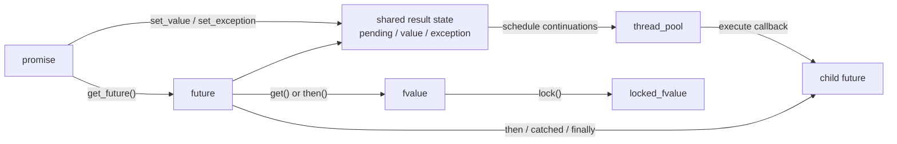

# Future semantics

The future subsystem in `common-lib` provides typed asynchronous composition
on top of an application-supplied thread pool. It is intended for operations
that produce a value or an exception later and for building non-blocking
workflows from those operations.

The model is continuation-based: an operation settles once, `then()` transforms
a successful result, `catched()` handles a failure, `finally()` performs
outcome-independent work, and a future returned by a callback is flattened
into the surrounding chain. Result types are known statically, execution
contexts are explicit, handles are move-only, shared values are accessed under
a lock, and blocking observation remains available when required.

The future API and its default execution context are available through:

```cpp
#include <common-lib/thread/thread.h>
```

They are exported in the `vshalygin::cl` namespace.

## Core model

Four concepts form one asynchronous operation:

- `promise` owns the right to settle the operation through `set_value()` or
  `set_exception()`;
- `future` observes the eventual value or exception and creates continuation
  branches;
- `fvalue` is a move-only handle through which stored values are accessed;
- `ftuple` represents multiple values as one future result.



The shared result state begins pending and settles with exactly one of two
outcomes:

- a value, including `void`; or
- an `std::exception_ptr`.

Each continuation returns a new future with its own result state. Registering
a continuation does not consume the source future or its stored result.

## Creating and completing an operation

A promise is parameterized by its stored value type and constructed with the
thread pool used by its future graph. The future handle may then be retrieved
once. A promise does not store or execute a producer callable. The asynchronous
operation is responsible for arranging its own execution and completing the
promise when a result becomes available:

```cpp
vshalygin::cl::thread_pool pool{4};

vshalygin::cl::promise<vshalygin::cl::thread_pool, int> result_promise(&pool);
auto result_future = result_promise.get_future();
result_promise.set_value(36);
```

`set_value()` also supports `void`, references, move-only values, and `ftuple`.
A producer that already has a failure completes the state with an
`std::exception_ptr`:

```cpp
vshalygin::cl::promise<vshalygin::cl::thread_pool, int> error_promise(&pool);
auto error_future = error_promise.get_future();

std::optional<int> result;
std::exception_ptr failure;
try {
    result = perform_operation();
} catch(...) {
    failure = std::current_exception();
}

if(failure) {
    error_promise.set_exception(failure);
} else {
    error_promise.set_value(std::move(*result));
}
```

Work can be posted explicitly when it should run on the supplied pool:

```cpp
vshalygin::cl::promise<vshalygin::cl::thread_pool, int> square_promise(&pool);
auto square_future = square_promise.get_future();

pool.post([promise = std::move(square_promise)]() mutable {
    std::optional<int> result;
    std::exception_ptr failure;
    try {
        result = calculate_square(6);
    } catch(...) {
        failure = std::current_exception();
    }

    if(failure) {
        promise.set_exception(failure);
    } else {
        promise.set_value(std::move(*result));
    }
});
```

`set_value()` and `set_exception()` share one thread-safe, one-shot completion
right. Exactly one competing call can claim it. Every later call throws
`std::future_error` with
`std::future_errc::promise_already_satisfied`. Passing an empty
`std::exception_ptr` is rejected without consuming the completion right.
`get_future()` transfers the only future handle owned by the promise.

If an unresolved valid promise is destroyed or replaced by move assignment,
its future settles with `std::future_errc::broken_promise`. Moving a promise
transfers responsibility for completing it.

A ready future can also be constructed directly when no producer is needed:

```cpp
vshalygin::cl::future ready_value(&pool, 42);
vshalygin::cl::future ready_void(&pool);
```

Continuations attached to an already settled future are still scheduled
through the thread pool; they are not invoked inline by `then()`, `catched()`,
or `finally()`.

## Accessing a value

`future::get()` waits for settlement. It rethrows a stored exception or returns
an `fvalue` for a non-void result. Calling `get()` does not extract the stored
value from the shared state, so the future can be observed again.

```cpp
auto value_handle = result_future.get();
auto locked_value = value_handle.lock();

std::cout << *locked_value << '\n';
```

`fvalue::lock()` acquires the mutex associated with the stored value and
returns a `locked_fvalue`. The lock remains held until that object is destroyed.
The locked object supports `operator*`, `operator->`, and `with()`:

```cpp
result_future.get().lock().with(
    [](const int &value) {
        std::cout << value << '\n';
    });
```

`with()` invokes its callback while the value remains locked. Its parameter
type controls whether the stored object is observed by reference, copied, or
moved. Moving from a stored value leaves that shared value in its normal
moved-from state, which is visible to other branches.

Constness of an `fvalue` handle applies to the handle, not automatically to the
stored object. A callback that requires read-only access should request a
`const` reference explicitly.

The lock is necessary because several continuation branches may refer to the
same stored state and may execute on different worker threads. It protects
access performed through that same mutex; it does not make unrelated external
accesses safe and does not extend the lifetime of an externally owned object.

Keep the locked scope as short as possible. In particular, do not call
`get()`, `wait()`, or `wait_for()` while holding a value lock when completion of
the awaited operation may need the same value. The library cannot infer a
user-defined lock dependency graph, so avoiding deadlocks between value locks,
application mutexes, and blocking waits is the caller's responsibility.

## Chaining successful operations

`then()` registers a callback for successful completion and returns a new
future. For a non-void source, the callback receives an `fvalue`. For a void
source, it receives no argument. The callback's return type determines the
stored type of the returned future.

```cpp
vshalygin::cl::promise<vshalygin::cl::thread_pool, int> source_promise(&pool);

auto result = source_promise.get_future()
    .then([](auto source_fvalue) {
        auto source = source_fvalue.lock();
        return source.with([](int value) {
            return value + 4;
        });
    })
    .then([](auto source_fvalue) {
        auto source = source_fvalue.lock();
        return source.with([](int value) {
            return std::to_string(value);
        });
    });

source_promise.set_value(36);

result.get().lock().with(
    [](const std::string &text) {
        // text == "40"
    });
```

Every `then()` call creates an independent child future. Several callbacks may
therefore be attached to the same source to form branches. Sibling callbacks
may execute concurrently, and their relative execution order must not be
relied upon.

If the source contains an exception, its success callback is skipped and the
exception propagates to the child future. If the callback itself throws, that
exception becomes the child future's failure.

## Multiple values with `ftuple`

`ftuple` lets one stage produce several typed values. When the result is
accessed through `locked_fvalue::with()`, its elements become separate callback
arguments:

```cpp
using parsed_value = vshalygin::cl::ftuple<std::size_t, std::string>;
vshalygin::cl::promise<vshalygin::cl::thread_pool, parsed_value>
    parse_promise(&pool);

auto parsed = parse_promise.get_future().then(
    [](auto source_fvalue) {
        auto source = source_fvalue.lock();
        return source.with(
            [](std::size_t size, const std::string &text) {
                return size == text.size();
            });
    });

std::string message = "message";
parse_promise.set_value(
    vshalygin::cl::ftuple{message.size(), std::move(message)});
```

Class template argument deduction stores values by default. Explicit reference
element types can be used when reference semantics are intended. Nested
`ftuple` elements are deliberately unsupported.

## Error propagation and recovery

`catched()` registers a callback that receives `std::exception_ptr`. It is
called only if the source future fails. A successful source bypasses the
handler and propagates its value to the returned future.

Return a value of the source type to recover from an error and continue the
same typed chain:

```cpp
auto recovered = operation_future.catched(
    [](std::exception_ptr error) {
        try {
            std::rethrow_exception(error);
        } catch(const std::exception &e) {
            log_error(e.what());
        }

        return response{};
    });
```

The handler may instead return a future storing the same type; that future is
flattened and its eventual outcome becomes the recovery result. Returning
`void` creates a `future<ThreadPool, void>`, intentionally discarding the value
type for both the success and recovered-failure paths.

If a `catched()` callback throws, its returned future fails with the new
exception. A later `catched()` may handle that failure.

## Completion actions with `finally`

`finally()` runs after either success or failure and receives no outcome
argument. It is intended for cleanup, notification, and other actions that do
not transform the source value.

```cpp
auto completed = operation_future.finally(
    [&activity] {
        activity.mark_finished();
    });
```

The callback must return `void` or `future<ThreadPool, void>`. If it completes
successfully, the returned future preserves the source value or exception. If
the callback throws or its returned future fails, the cleanup failure becomes
the returned future's exception.

Successful cleanup is transparent, while failed cleanup replaces the previous
outcome.

## Future flattening

When a `then()` or `catched()` callback returns a future by value, the outer
operation adopts the returned future's eventual stored type and outcome. The
caller receives one flattened future rather than a `future<future<T>>`.

```cpp
auto async_double = [&pool](int value) {
    vshalygin::cl::promise<vshalygin::cl::thread_pool, int> promise(&pool);
    auto future = promise.get_future();
    pool.post([promise = std::move(promise), value]() mutable {
        promise.set_value(value * 2);
    });
    return future;
};

auto doubled = source_future.then(
    [&async_double](auto source_fvalue) {
        auto source = source_fvalue.lock();
        return source.with(
            [&async_double](int value) {
                return async_double(value);
            });
    });
```

If `source_future` stores `int`, `doubled` also stores `int`, not another
future. Exceptions from either level propagate through the flattened chain.
The returned future must be valid and returned as an unqualified value; an
invalid returned future settles the outer chain with `std::logic_error`.

Flattening also preserves the controller that owns the adopted value state.
Consequently, values or references backed by a returned future remain valid
for as long as the flattened result requires that source state.

## Reference and lifetime semantics

Future result types may contain references. Two cases must be distinguished:

1. A continuation returns a reference into a value stored by an ancestor
   future. The descendant retains the source controller and uses the same value
   mutex, keeping the ancestor state alive and synchronizing access through the
   chain.
2. `set_value()` or a continuation supplies a reference to an application-owned
   object. The future stores only that reference. The application must keep the
   referenced object alive and must coordinate every access made outside the
   future chain.

The library can preserve ownership relationships that exist inside its own
future graph; it cannot manufacture ownership for an arbitrary external
reference.

Registered continuation state may also outlive the visible `future` or
`promise` handle. Destroying those handles after an operation has been started
does not cancel callbacks that are already retained by the chain. Captured
application objects must therefore follow normal asynchronous lifetime rules.

The thread pool pointer is non-owning. The pool must remain alive and active
until all promises, futures, callbacks, value handles, and asynchronous work
using it have finished.

## Blocking observation

Continuation chains are the preferred way to compose asynchronous operations,
but the future also provides synchronous observation:

- `wait()` blocks until either a value or an exception is available;
- `wait_for(timeout)` blocks for at most the requested duration and reports
  whether the future became ready;
- `get()` blocks until ready, rethrows a stored exception, and returns `fvalue`
  for a non-void result;
- `has_value()` and `has_exception()` report the current settled state without
  waiting.

Avoid blocking a worker belonging to the same pool when the operation being
waited for requires that worker to make progress. With a small or single-thread
pool, such blocking can starve the operation and deadlock the workflow.

## Validity and move semantics

Promises, futures, and value handles are move-only. A default-constructed or
moved-from object is invalid. `is_valid()` can be used before an optional
operation, while methods that require state throw `std::logic_error` when
called on an invalid object.

Move-only result values are supported. A continuation that wants to transfer
such a value to its child stage must explicitly move it while holding the value
lock.

## Suitable uses

The future model is useful for:

- expressing a sequence of dependent asynchronous steps;
- bridging a callback-triggered operation into a typed result;
- propagating failures through a multi-stage workflow;
- recovering asynchronously from an error;
- waiting for asynchronous cleanup before preserving an earlier outcome;
- branching several computations from one settled value;
- composing an operation that itself starts another asynchronous operation;
- carrying several related result values with `ftuple`.

The abstraction does not prescribe cancellation, retries, deadlines, or
application shutdown policy. Those behaviors belong to the operation that
creates the promise and can be represented through its result, exception, or a
separate control object.

## Guarantees and caller responsibilities

The future subsystem guarantees that:

- a valid promise can be completed exactly once through `set_value()` or
  `set_exception()` even when callers race;
- destroying an unresolved promise reports `broken_promise` to its future;
- continuations are scheduled through the supplied thread pool, including
  continuations registered after settlement;
- exceptions skip success callbacks and propagate until handled;
- `then()`, `catched()`, and `finally()` each return a distinct child future;
- a future returned by value is flattened and its failure propagates;
- internal source states needed by reference-valued descendants and flattened
  results are retained;
- access through `fvalue::lock()` is serialized by the value's mutex.

The caller remains responsible for:

- keeping the thread pool alive and able to execute work;
- keeping externally referenced objects alive;
- synchronizing access performed outside the future's value lock;
- avoiding lock-order inversions, recursive locking, blocking under a value
  lock, and worker-pool starvation;
- deciding how operations are canceled or abandoned;
- not relying on execution order between independent continuation branches.

## Related documentation

- [`common-lib` overview](../common-lib/README.md)
- [Repository architecture](architecture.md)
- [Testing](testing.md)
- [Documentation index](README.md)
