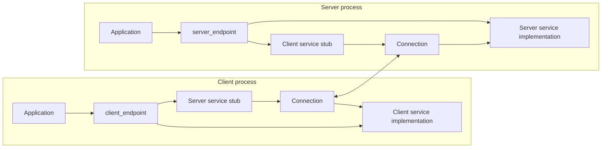
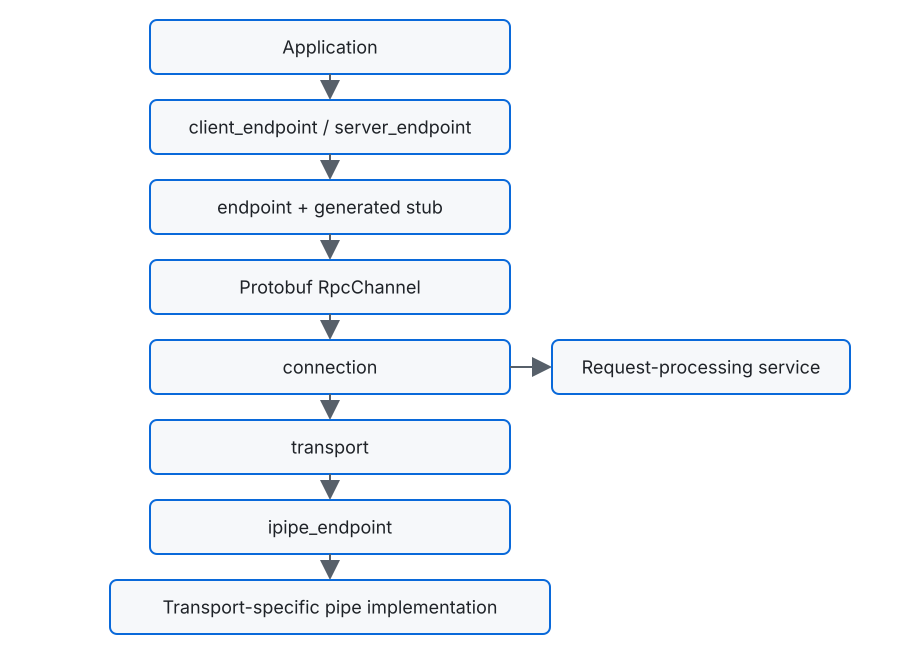
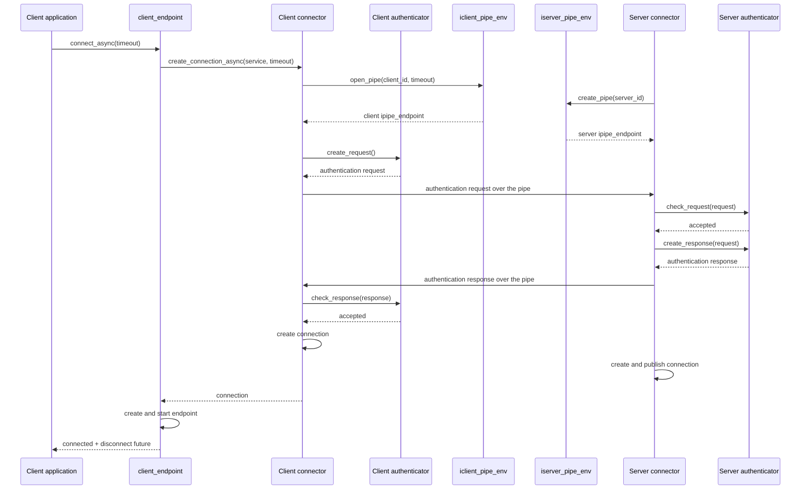
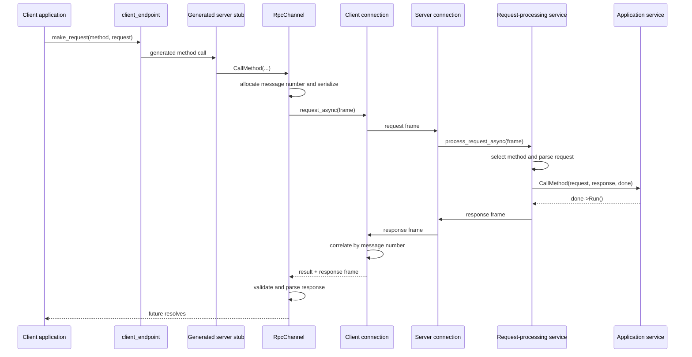

# RPC architecture and protocol

`rpc-lib` provides asynchronous, bidirectional RPC based on Protocol Buffers
generic services. This document explains its component model, connection and
request flows, transport extension points, wire format, and lifetime rules.

The public API is in the `vshalygin::rpc` namespace. Types under
`vshalygin::rpc::internal` and headers under `rpc-lib/internal/` are described
here to explain the architecture; they are not public extension points.

## Design overview

An RPC connection is symmetric after it has been established. Each side owns:

- a generated stub for calling the service implemented by the peer;
- a local generated service implementation that handles calls from the peer;
- one asynchronous connection carrying requests and responses in both
  directions.

The words *client* and *server* primarily describe how the underlying transport
connection is established. They do not restrict the direction of RPC calls.

All potentially waiting work is fully asynchronous. Establishing or accepting
a transport endpoint, performing the handshake, reading and writing messages,
waiting for a response, applying timeouts, and completing disconnection are
expressed through futures and callbacks scheduled on the supplied execution
context. The RPC API has no method that blocks the calling thread while waiting
for an external event or another operation to complete. Internal methods may
briefly block while acquiring mutexes used to protect an object's shared
mutable state; those critical sections do not perform transport I/O or wait for
asynchronous completion.



`client_endpoint<RemoteStub, LocalService>` manages one active peer
connection. `server_endpoint<RemoteStub, LocalService>` listens for connections
and manages an endpoint per connected peer. The server assigns a connection ID
to each accepted peer; application service code can obtain that ID through
`iresponse_controller` when it needs to address the same peer later.

## Layered model

The implementation is divided into layers with deliberately narrow
responsibilities:



### Public endpoints

`client_endpoint` and `server_endpoint` are the application-facing owners of
RPC state.

The client endpoint:

- asks a client pipe environment to establish a transport endpoint;
- performs the authentication handshake;
- owns one connected endpoint;
- exposes connection state, disconnect, and outgoing request operations;
- supplies a local service implementation for calls initiated by the server.

The server endpoint:

- starts and stops listening through a server pipe environment;
- performs the handshake for every accepted transport endpoint;
- owns the active endpoint associated with each connection ID;
- reports listening and per-connection lifecycle changes;
- can send a request to one connection or to all active connections;
- supplies a local service implementation for calls initiated by clients.

### Endpoint and channel

An internal endpoint binds one connection to a generated Protocol Buffers
service stub. Its channel implements `google::protobuf::RpcChannel`, translating
a generated stub invocation into an asynchronous library request.

The channel assigns a monotonically increasing message number, serializes the
request, and later validates and parses the correlated response. The public
result is delivered as a `cl::future` containing a `request_result` and the
typed response object.

### Connection

A connection owns the request correlation state and the continuous receive
loop. It:

- tracks outstanding requests by message number;
- applies request-response timeouts;
- dispatches incoming request, response, ping, and pong messages;
- forwards incoming requests to the request-processing service;
- completes pending requests when their responses arrive;
- monitors peer activity and deactivates an unresponsive connection;
- completes pending operations when the transport stops.

There is one receive loop per connection. Responses may arrive independently
of request order and are matched through their message numbers.

### Request-processing service

The request-processing service implements the incoming RPC execution path. It
selects the requested method from the service descriptor, constructs the
generated request and response types, parses the request, invokes `CallMethod()`
on the application-provided `google::protobuf::Service`, and forms the response
sent back through the connection.

Application service methods follow the Protocol Buffers generic-service
contract: they must eventually invoke the supplied completion closure exactly
once. Completion serializes the response and sends it back through the same
connection.

### Transport and pipe

The internal transport adapts the RPC connection to the public
`ipipe_endpoint` interface. A pipe endpoint is message-oriented: one successful
write submits one complete buffer and one successful read returns one complete
buffer. Stream framing, operating-system handles, sockets, and in-process
queues remain implementation details of the selected pipe.

Pipe environments establish endpoints:

- `iclient_pipe_env` asynchronously opens the client side;
- `iserver_pipe_env` asynchronously creates or accepts the server side;
- both interfaces support cancellation of pending establishment operations.

The repository currently provides in-memory, TCP, and Windows named-pipe
implementations. A higher layer does not branch on the concrete transport after
receiving an `ipipe_endpoint`.

## Establishing a connection

Transport establishment and RPC authentication are separate phases. A
connected pipe is not exposed as an RPC connection until the handshake has
completed successfully.



`connect_async(timeout)` applies its argument to waiting for the underlying
client transport endpoint. The authentication exchange has its own timeout in
the RPC configuration. A failed pipe operation, rejected authentication
payload, or timeout fails the asynchronous connection chain.

The client connection result also contains a future that completes when that
connection is disconnected. The server continues accepting transport
endpoints while it is listening and publishes each successfully authenticated
connection with its assigned ID.

### Authentication boundary

`iauthenticator` defines one request/response exchange:

- the client creates an opaque request buffer;
- the server validates it and creates an opaque response buffer;
- the client validates the response.

The handshake format is owned entirely by the authenticator. This makes it
possible to add application-specific credentials without coupling the RPC
protocol to one credential representation.

`simple_authenticator` accepts every request and response. It is useful for
examples and trusted scenarios but does not provide authentication security.
The RPC library does not add encryption or transport security automatically;
those properties must be provided by the selected transport or an additional
security layer.

## Outgoing request flow

The same flow applies in either direction. In this diagram the client calls a
method implemented by the server:



Multiple requests may be outstanding on one connection. Each request has an
independent message number and completion state. A local send failure, response
timeout, malformed response, remote processing failure, or missing connection
is represented through `request_result` rather than through a partially parsed
successful response.

## Connection monitoring

Every active connection monitors incoming activity. At each configured check
period:

1. recent incoming activity clears the idle state;
2. if there was no activity, the connection sends a ping and begins waiting;
3. any subsequently received message, including pong, counts as activity;
4. if no activity is observed within the ping timeout, the connection is
   deactivated.

The mechanism detects a peer that remains physically connected but no longer
responds. It is independent of the timeout applied to an individual request.
The library does not automatically reconnect a deactivated client endpoint; a
new connection must be initiated by its owner.

## Configuration

The `config` object controls RPC-level timing:

| Setting | Purpose | Default |
| --- | --- | ---: |
| `handshake_timeout` | Read and write timeout for authentication messages. | 2 s |
| `send_timeout` | Timeout for sending a transfer message. | 2 s |
| `recv_timeout` | Maximum time an outgoing request waits for its response. | 10 s |
| `check_connection_period` | Interval between connection activity checks. | 1 s |
| `ping_timeout` | Maximum time to observe activity after pinging an idle peer. | 10 s |

The timeout passed to `client_endpoint::connect_async()` is separate: it limits
waiting for the underlying transport connection before the handshake.

## Transfer protocol

After authentication, a connection exchanges four transfer message types:

| Type | Direction | Purpose |
| --- | --- | --- |
| `req` | Either | Serialized RPC request. |
| `res` | Either | Response correlated to a request. |
| `ping` | Either | Peer liveness probe. |
| `pong` | Either | Liveness response. |

Integer fields use big-endian byte order.

### Request frame

```text
+---------------+----------------------+--------------------+----------------+----------------+
| type: 1 byte  | proto size: 4 bytes  | protobuf payload   | id: 8 bytes    | method: 4 bytes|
| req           | unsigned, big-endian | <proto size bytes> | big-endian     | big-endian     |
+---------------+----------------------+--------------------+----------------+----------------+
```

The method field is the method index in the generated service descriptor.

### Response frame

```text
+---------------+----------------------+--------------------+----------------+----------------+
| type: 1 byte  | proto size: 4 bytes  | protobuf payload   | id: 8 bytes    | result: 1 byte |
| res           | unsigned, big-endian | <proto size bytes> | big-endian     | response code  |
+---------------+----------------------+--------------------+----------------+----------------+
```

Ping and pong frames currently consist of their one-byte type. A transport may
add its own framing outside this transfer message. For example, the TCP pipe
prefixes every complete transfer or handshake buffer with a four-byte
big-endian payload length so the receiving side can recover message boundaries
from the byte stream.

The current limits are 1 MiB for a serialized request and 1 MiB for a serialized
response. A complete transfer buffer is limited to 1 MiB plus 100 bytes for
protocol overhead.

### Compatibility considerations

The transfer frame contains no protocol version, service name, or method name.
Peers must agree on:

- the transfer protocol implemented by their library versions;
- the service bound to each endpoint;
- the ordering of methods in the generated service descriptor;
- wire-compatible Protocol Buffers request and response schemas.

Changing a method's descriptor index can route a request to a different method
even when the individual message schemas remain Protobuf-compatible. There is
currently no automatic version or capability negotiation, so the protocol
should not yet be treated as a stable cross-version wire contract.

## Transport extension contract

A custom transport integrates below the RPC layer by implementing the relevant
pipe environment and `ipipe_endpoint` interfaces. The endpoint contract
requires that an implementation:

- be active when returned by a successful environment operation;
- preserve complete message boundaries;
- support asynchronous reads and writes, with and without timeouts;
- complete every operation exactly once with `success`, `timeout`, `canceled`,
  or `failed`;
- complete pending operations as canceled when explicitly invalidated;
- complete pending and subsequent operations as failed after an unexpected
  connection loss;
- invoke the disconnect callback, including immediately when it is registered
  after the connection has already been lost;
- reject or fail an incoming message larger than `MaxTransferMessageSize`;
- treat destruction as invalidation;
- not attempt transparent reconnection inside the same endpoint.

Client and server environments are responsible for pairing or establishing
the two transport sides and for canceling pending establishment operations by
owner ID. A transport implementation may use sockets, operating-system IPC,
shared memory, an in-process queue, or another mechanism as long as it preserves
these semantics.

## Ownership, lifetime, and execution

An application supplies a `cl::thread_pool` to the RPC objects. The pointer is
non-owning: the application must keep the pool alive and active until all
endpoints, pipe environments, services, futures, and pending callbacks that use
it have finished.

Authenticators, pipe environments, and generated service implementations are
passed with shared ownership because asynchronous operations may outlive the
call that started them. Endpoint implementations own connections; connections
own their transport adapters and retain the request-processing service needed
to serve incoming calls.

Destroying an application-facing RPC object does not necessarily destroy its
internal implementation immediately. Futures and callbacks that have already
been scheduled may retain shared ownership of implementation objects while
they execute on another thread. Destruction starts cancellation and teardown;
the implementation itself remains alive until the outstanding asynchronous
work releases its references. Consequently, callbacks must not assume that the
corresponding public object still exists, and application-owned objects passed
by non-owning reference must satisfy their documented lifetime requirements
independently of the public object's lifetime.

Callbacks and future continuations execute through the supplied asynchronous
execution context. Application callbacks and service implementations must
synchronize any state they share with other threads. Destroying or explicitly
disconnecting an endpoint begins cancellation and teardown, but application
code must still respect the lifetime of any objects it supplied by non-owning
reference.

## Public results and lifecycle notifications

Outgoing calls complete with `request_result`. It distinguishes success from
conditions such as no connection, send failure, cancellation, timeout, invalid
response, parse failure, oversized request, and remote processing failure.

The server endpoint reports:

- transition into and out of listening state;
- connection and disconnection of each assigned connection ID;
- the current number of active connections.

The client exposes its current connection state, explicit disconnect, and the
disconnect future returned by a successful asynchronous connection. These
signals allow an application to maintain its own retry or reconnection policy
outside the transport and RPC internals.

## Related documentation

- [Repository architecture](architecture.md)
- [Building and installing](build-and-install.md)
- [Testing](testing.md)
- [`rpc-lib` overview](../rpc-lib/README.md)
- [`rpc-example`](../example/rpc-example/README.md)
